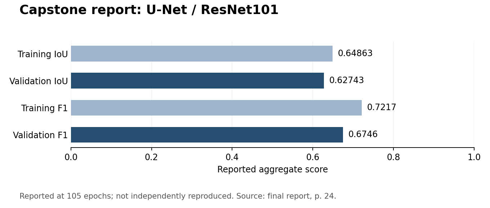

# Computer Vision for Building Damage Assessment Using Satellite Imagery of Natural Disasters

Undergraduate capstone by **Mohammad Hachim Eraissouni** (2023), using xBD satellite imagery to segment building footprints and assign damage categories. The final report describes a TensorFlow/Keras **U-Net with a ResNet101 encoder**, operating on 512 × 512 RGB tiles and producing five pixel classes: background, undamaged, minor damage, major damage and destroyed.

**Status:** recovered academic research archive, prepared for eventual public release. The final architecture is recovered; the exact training data, 105-epoch run history and checkpoint-to-result association are incomplete. The repository does not claim independent reproduction of the original results. Repository preparation in October 2026 is documented separately from the undergraduate experiments.

## Reported results

| Split | Dice loss | IoU | F1 |
| --- | ---: | ---: | ---: |
| Training | 0.2238 | 0.64863 | 0.7217 |
| Validation | 0.2983 | **0.62743** | **0.6746** |

These are **reported values from the final report**, printed page 24 (PDF page 33), for a model described as having reached 105 epochs out of 150 planned. They were not recalculated during cleanup. Validation combined the xBD hold and test subsets; it is not an independent test result. The recovered code uses Segmentation Models metrics, not the official xView2 competition score. See [result provenance](results/README.md) and [reproducibility status](docs/REPRODUCIBILITY.md).



## Historical HPC training and checkpoint provenance

**Plausible final-checkpoint candidate:** `27112023184806` is explicitly selected in both recovered inference notebook sources. A hidden notebook preserves sequential prediction calls and four PNG outputs, strengthening the evidence that it was used locally. Its association with the final HPC run, 105 epochs and the reported validation scores remains unverified. The author's account of retaining HPC-trained weights is recorded as recollection.

The conditional optimizer count is compatible with an earlier best checkpoint from a longer run, but no history proves this explanation. See [the forensic findings and evidence tiers](docs/HISTORICAL_HPC_PROVENANCE.md) and [safe application wording](docs/APPLICATION_WORDING.md).

## Repository structure

```text
src/building_damage/       Later packaging and explicit-path train/evaluate commands
configs/                  Report-described and recovered-code parameter variants
notebooks/                Guided inspection notebook with no saved data/output
archive/final_candidate/  Original builder/helpers and sanitized inference notebook
docs/                     Data, environment, reproducibility, limitations, rights
results/                  Report values and a labeled summary chart
references.bib            Dataset, architecture, optimizer and software references
CHANGELOG.md              Original work versus repository preparation
```

The public candidate excludes raw/derived data, model weights, memory maps, bytecode, output-heavy notebooks, full report PDFs and unrelated template code. A separate local audit and exact source archive preserve original artifacts. [Experiment catalogue](archive/README.md) explains the earlier PyTorch and later SAM work.

## Installation and quick inspection

Use an isolated environment. The cleanup compatibility recipe uses TensorFlow 2.16 with legacy Keras, not an assertion about the original 2023 package versions. See [environment details](docs/ENVIRONMENT.md) before GPU use.

```bash
python3.12 -m venv .venv
source .venv/bin/activate
python -m pip install -r requirements.txt
python -m pip install --no-deps -e .
python -m pip check
python -m building_damage --help
```

This installs dependencies and exposes commands; it does not download data or start training. The guided [project overview notebook](notebooks/project_overview.ipynb) reads only the reported-result JSON.

## Dataset and preparation

Acquire xBD through [the official xView2 dataset page](https://xview2.org/dataset), accepting the applicable dataset/imagery terms. Keep data in an external directory. No dataset is redistributed here. See [dataset acquisition, storage and preparation](docs/DATA.md).

The report describes post-disaster imagery only: tier1+tier3 for training (9,168 scenes), hold+test for validation (1,866 scenes). It describes four 512-pixel tiles per 1024-pixel scene, damage-targeted training augmentation and no validation augmentation. The final preparation driver and resulting training/validation arrays were not recovered. Do not substitute the later 224-pixel crops or SAM layouts.

## Training

The new wrapper accepts **existing, provenance-verified** final arrays and records the chosen configuration. It is a cleanup implementation, not the recovered original training driver. It defaults to a preparation check; training requires the explicit `--execute` flag. No training was performed during repository preparation.

```bash
python -m building_damage train --config configs/report_described.json \
  --train-images /external/final_tiles/X_train.npy \
  --train-masks /external/final_tiles/y_train.npy \
  --val-images /external/final_tiles/X_val.npy \
  --val-masks /external/final_tiles/y_val.npy \
  --output-dir outputs/new_run
```

After explicitly approving a new experimental phase, add `--execute` to launch a new run. Use a fresh output directory. `report_described.json` records the report's learning rate 1e-4 and planned 150 epochs. `recovered_builder.json` records the builder's 1e-5 learning rate. Neither config establishes the parameters used by the missing historical run. See [training/evaluation details](docs/WORKFLOWS.md).

## Evaluation

With provenance-verified arrays and a compatible local TensorFlow checkpoint prefix:

```bash
python -m building_damage evaluate --config configs/recovered_builder.json \
  --images /external/final_tiles/X_val.npy \
  --masks /external/final_tiles/y_val.npy \
  --checkpoint /external/checkpoints/best_model.ckpt \
  --output-dir outputs/checkpoint_evaluation
```

This also defaults to a data/configuration check; `--execute` evaluates and records a **new** result separately. Do not relabel it as the historical report result. Evaluation uses the library's probability-based aggregate metrics over all five classes; batch size matters. Candidate weights are excluded from Git and their association with 105 epochs is unverified.

## Limitations

The report notes confusion between nearby damage classes and inaccurate building boundaries. Aggregate scores obscure class imbalance. No independent test protocol, per-class scores, event/geographic leakage analysis or operational validation was recovered. Pre/post comparison and Barlow Twins are proposed extensions in the report, not part of the final evaluated model. Later SAM work is experimental and contains broken gradient paths. See [limitations](docs/LIMITATIONS.md).

## References and reuse

Please cite xBD, U-Net, ResNet and Segmentation Models when discussing this project; entries are in [references.bib](references.bib). The final report's author/title/year are the project attribution; no publication DOI or public repository URL is invented.

**License:** author-owned code and accompanying repository documentation are released under the [MIT License](LICENSE), copyright 2023–2026 Mohammad Hachim Eraissouni. Reuse is permitted with the copyright and license notices retained. Dataset, imagery, full report and third-party dependencies have separate terms; see [license scope](docs/LICENSE_RECOMMENDATION.md), [NOTICE](NOTICE.md) and the [release checklist](docs/RELEASE_CHECKLIST.md).
